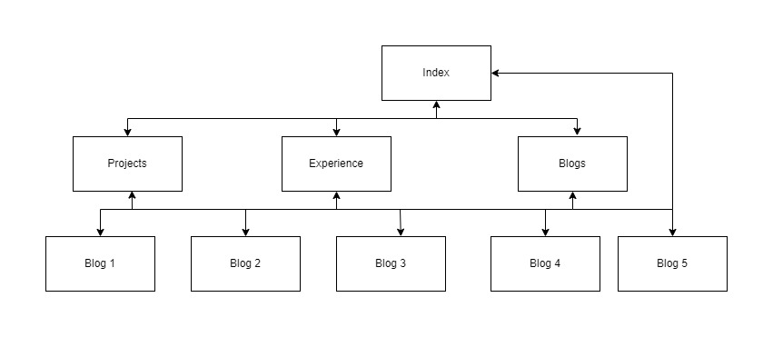
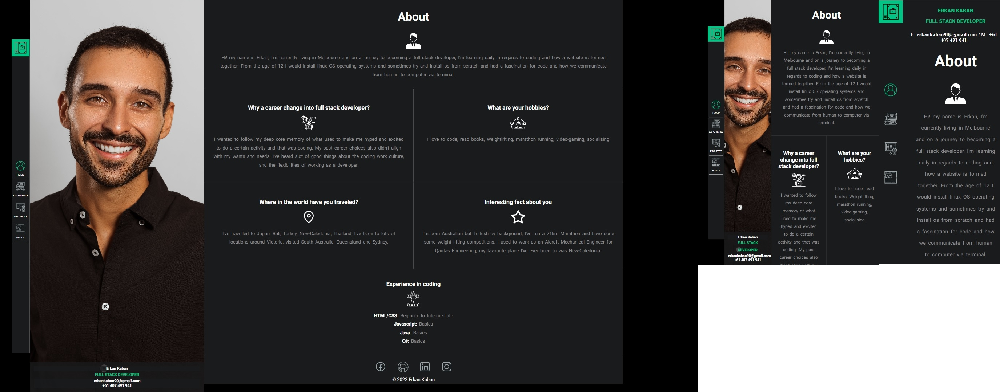

# Portfolio Documentation
## [Portfolio Website](https://link-url-here.org)

## [Github Repo](https://github.com/Erkan-Kaban/ErkanKaban_T1A2)

## Purpose and Target Audience

The portflios purpose was to showcase myself, my experience and abilities to be presented almost like a resume
on a webpage essentially, my target audience are anyone looking at hiring in the
IT field that are looking into 
my page to see if I'm the right fit for a role.

## Functionality/Features

The entire HTML documents are fully semantic tagged as well as linked to individual style tags for each html document, I found that if I was going to put it in one entire css it may confuse me furter due to the length. My design was mainly focused on scrolling top to bottom fashion but also have some kind of feature horizontally that folds out into a photo of me with my description depending on the device used. it has the main pages listed out as follows:

   - Index/home: This became my about me page essentially showcasing who i am and some brief questions that I've answered.
   - Experience: I wanted to show my past experience on another page, listing out my past work background and listing a resume link at the very end is handy.
   - Projects: A projects page to eventually show case what projects I have listed out.
   - Blogs: A blogs page with blogs that are suitable to the field I'll be working in, with my own blogs and write ups on what we'll be learning down the track.
  
  

## Sitemap
Created using draw.io

## Wireframes/Screenshots

### Index Page

## Projects Page:

## Experience Page:

## Blogs Page:

## Blogs Post Page

## Technology Stack

- Wireframes: draw.io
- Image editing: MS Paint
- Website: HTML5 & CSS3
- Deployment: Github Pages
